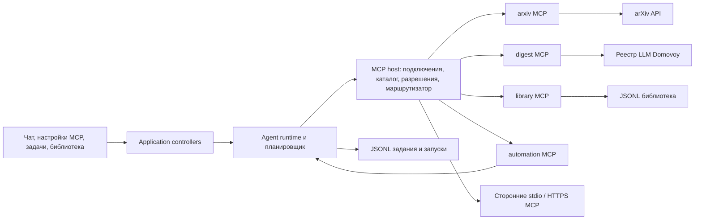

# MCP в Domovoy: архитектура и план работ для дней 16–20

Статус: **проект решения для передачи исполнителям; реализация не начата**.
Источник требований: [`tasks.md`](../tasks.md). Этот документ фиксирует принятые
в обсуждении решения и критерии приёмки. Один крупный блок работ ниже целиком
передаётся одному кодеру. Блоки можно выполнять параллельно после завершения их
зависимостей, но общий код интегрируется в указанном порядке.

## 1. Результат и граница проекта

Domovoy становится MCP host: подключает произвольные настроенные пользователем
серверы через **stdio** или **Streamable HTTP**, обнаруживает инструменты,
показывает их человеку и даёт агенту вызывать разрешённые инструменты. Для
демонстрации в самом приложении работают **четыре самостоятельных локальных
MCP-сервера**:

| Сервер | Ответственность | Основные инструменты |
|---|---|---|
| `arxiv` | Поиск и чтение описательных данных arXiv | `search_papers`, `get_paper` |
| `digest` | Обработка аннотаций через существующий LLM-провайдер | `summarize_papers` |
| `library` | Локальная библиотека статей и сводок в JSONL | `save_digest`, `list_saved`, `get_saved` |
| `automation` | Напоминания, cron-задания и история запусков | `create_task`, `list_tasks`, `pause_task`, `run_task_now` |

Это четыре разных экземпляра MCP-сервера с разными именами, каталогами tools и
подключениями клиента. Они могут жить в одном процессе Flutter и одном корневом
пакете `domovoy`. Объединять их в один MCP endpoint нельзя: для дня 20 нужно
доказать маршрутизацию между серверами.

Обязательная цепочка дня 19: `arxiv.search_papers` →
`digest.summarize_papers` → `library.save_digest`. Инструменты передают
структурированные данные друг другу через агентский вызов; сам агент выбирает
следующий инструмент и видит результат предыдущего. День 20 добавляет
`automation` и сценарий с несколькими запусками и серверами. Сторонний
DuckDuckGo MCP используется как дополнительная проверка совместимости клиента.

### Что входит в первый этап

- Полный цикл MCP tools: обнаружение с пагинацией, отображение, выбор,
  `tools/call`, результат, ошибка, переподключение и обновление каталога.
- Сторонние stdio-серверы на desktop и сторонние Streamable HTTP-серверы по
  публичному HTTPS на desktop и телефоне; серверы без авторизации или с
  предоставленным пользователем bearer-токеном.
- Четыре наших сервера на **каждом** поддерживаемом устройстве, без связи между
  ПК и телефоном.
- arXiv-подборка по метаданным и аннотациям, сводка с источниками, JSONL-библиотека.
- Произвольный промпт задания, cron-расписание, раздел задач и запусков,
  необязательная карточка результата в выбранном чате.

### За пределами первого этапа

- Чтение и разбор PDF, индексация полного текста и перепубликация PDF.
- Синхронизация ПК и телефона, общий сервер, VPS или публичный доступ к нашим
  локальным MCP-серверам.
- Исполнение заданий после закрытия приложения, системный cron, Android
  WorkManager, push-уведомления вне приложения.
- OAuth для сторонних MCP-серверов, устаревший HTTP+SSE, UI для MCP resources,
  prompts, sampling и elicitation. SDK может поддерживать часть этих функций на
  проводе, но Domovoy пока не реализует их как host-сценарии.

Фраза «24/7» в задании дня 18 **не соответствует принятому ограничению**:
на Авроре закрытое приложение не выполняет работу. Демонстрация показывает
периодическую работу при запущенном приложении и восстановление расписания при
следующем открытии. Если проверяющий требует буквальные 24/7, нужен отдельный
процесс или сервер и новое продуктовое решение, а не иное cron-выражение.

## 2. Инварианты, принятые решения и ограничения

1. Соблюдать корневой [`AGENTS.md`](../AGENTS.md): один Flutter-пакет, один
   `pubspec.yaml`, прежний application ID, слои `presentation → application →
   domain`, инфраструктурные адаптеры за контрактами `core`, `ChangeNotifier`,
   явная композиция в `lib/app.dart`, conditional imports для платформенного
   кода, JSONL-персистентность и тесты в `test/`.
2. Основной SDK — `mcp_dart` стабильной ветки 2.4; закрепить совместимую версию
   в корневом `pubspec.yaml` и `pubspec.lock`. Его стабильный профиль пытается
   согласовать актуальный MCP и поддерживает fallback к прежним версиям.
   `dart_mcp` Dart-команды пока не даёт готового Streamable HTTP; добавлять
   собственную реализацию этого транспорта не планируется.
3. Наши четыре сервера доступны только локальному Domovoy. На desktop каждый
   имеет отдельный endpoint на `127.0.0.1`, без привязки к внешнему интерфейсу.
   Предпочтительны свободные динамические порты с передачей фактического адреса
   host-клиенту. Если высокоуровневый helper SDK не сообщает порт, использовать
   низкоуровневый HTTP transport. На Android и Авроре сначала выполнить
   платформенный smoke loopback; при невозможности использовать для каждого
   сервера отдельный `IOStreamTransport` внутри процесса.
4. Произвольный stdio-сервер на телефоне обещать нельзя: мобильная платформа не
   гарантирует запуск стороннего процесса. На телефоне поддерживаются наши
   встроенные серверы и сторонние HTTPS-серверы. На web нет локального stdio
   и встроенного HTTP-сервера; web-поведение определяется отдельным адаптером.
5. Внешний HTTPS означает **сторонний удалённый MCP**, не удалённый доступ к
   домашнему компьютеру. Домена, туннеля и связи устройств не требуется.
6. Секреты внешних серверов хранятся только в `flutter_secure_storage`;
   JSONL-конфигурация содержит ссылки на ключи хранилища, а не значения.
   Отдельный OAuth-only сервер в этом этапе может оказаться недоступен.
7. Настройки подключений общие для одного устройства. Набор доступных
   инструментов задаётся отдельно для чата/проекта и отдельно для каждого
   задания по расписанию. Новые tools на сервере не получают разрешение
   автоматически. Отсутствующий сервер или инструмент означает отказ вызова.
8. Задания исполняются только когда Domovoy активен. На телефоне таймеры
   останавливаются при уходе приложения из foreground и возобновляются при
   возврате. На desktop работа продолжается, пока процесс приложения запущен.
9. В задаче закреплены модель, промпт, выражение cron, часовой пояс, набор
   разрешённых инструментов и способ доставки результата. Изменение текущего
   чата не меняет уже созданную задачу.
10. Нужен человекочитаемый статус и трасса вызовов: какой сервер и инструмент
    выбраны, что завершилось ошибкой, какая сводка сохранена. Секреты и сырые
    токены в трассу не попадают.

Источники для решения по SDK: [mcp_dart 2.4](https://pub.dev/packages/mcp_dart/versions/2.4.2),
[транспорты и платформы](https://github.com/leehack/mcp_dart/blob/main/doc/transports.md),
[ограничения dart_mcp](https://pub.dev/packages/dart_mcp).

## 3. Архитектура



Стрелка `automation → планировщик` означает вызов application-сервиса через
внедрённый контракт, а не импорт UI или повторный вход в текущий агентский
turn. Запланированный запуск создаёт собственную агентскую сессию; результаты
связываются с задачей и, при выборе пользователя, с чатом.

### Предлагаемые границы кода

| Область | Содержимое |
|---|---|
| `lib/core/mcp/` | Типы подключения/каталога, идентификаторы, статусы, ошибки и контракты host/transport |
| `lib/core/research/` | Общие версионированные структуры `Paper` и `Digest` для трёх серверов, без зависимости от SDK |
| `lib/infrastructure/mcp/` | Адаптер `mcp_dart`, stdio/HTTP/stream, lifecycle, секреты и JSONL-конфигурация |
| `lib/infrastructure/mcp/servers/{arxiv,digest,library,automation}/` | Регистрация и обработчики четырёх MCP-серверов, без UI-зависимостей |
| `lib/core/automation/` | Модель задания, cron-правила, запуск, репозитории и политика catch-up |
| `lib/infrastructure/automation/` | Cron-адаптер, JSONL задания/запуски, часы и lifecycle-подключение |
| `lib/features/mcp/` | Настройки соединений, тест подключения, каталог tools и выбор прав |
| `lib/features/tasks/` | Раздел заданий, запуски, редактор cron и доставка результата |
| `lib/features/library/` | Просмотр сохранённых подборок через `library` MCP |
| `lib/app.dart` | Единственная production-композиция всех компонентов |

Это ориентир по путям, а не требование создавать каждый файл. Сервисы arXiv,
суммаризации и библиотеки могут иметь собственные `core`-контракты, если нужны
для тестов; transport-specific типы SDK должны оставаться в infrastructure.

### Жизненный цикл MCP host

1. При запуске прочитать локальные конфиги, получить ссылки на секреты и
   поднять четыре наших сервера; подключить к каждому отдельный MCP client.
2. Для сторонних серверов по явному включению пользователя создать клиент
   нужного транспорта. Stdio запускать как команду с массивом аргументов, без
   shell-интерполяции; stdout оставить только протоколу, stderr показать как
   диагностический поток с редактированием секретов. Дочернему процессу
   передавать минимально необходимое окружение и явно выбранные значения,
   а не все переменные приложения вместе с ключами LLM.
3. Получить `tools/list` до конца всех страниц, сопоставить пару
   `(connectionId, originalToolName)` со стабильным именем модели. Имя модели
   должно укладываться в ограничения LLM-провайдеров, быть уникальным и не
   зависеть от отображаемого alias; UI показывает исходные имена.
4. При изменении каталога или переподключении обновить реестр атомарно. Вызов,
   разрешённый старым каталогом, но отсутствующий сейчас, возвращает явную
   ошибку; права не расширяются автоматически.
5. `tools/call` маршрутизируется по сохранённой паре сервер/имя инструмента,
   учитывает cancellation, timeout, `isError`, текстовые и структурированные
   блоки. Неизвестный тип блока не теряется молча: UI и агент получают явное
   сообщение о неподдерживаемом содержимом.
6. При остановке приложения закрыть клиентов и наши серверы; для stdio
   дождаться корректного завершения дочернего процесса и затем очистить его.

Наши HTTP endpoint защищаются привязкой к `127.0.0.1`, проверкой Host/Origin
из SDK и короткоживущим случайным токеном в памяти процесса. Токен передаётся
только встроенным MCP-клиентам Domovoy; фиксированные порты и публичная
доступность не требуются. Для внешнего HTTPS-клиента принимать только `https://`
и не отправлять bearer-токен на другой origin при перенаправлении.

Для агентского слоя это требует изменить текущие
[`AgentToolRegistry`](../lib/core/agents/tools.dart) и
[`AgentDefinition.enabledTools`](../lib/core/agents/definition.dart): сейчас
реестр только добавляет tools, а определения чатов хранят статичный список.
Также текущий [`schema.dart`](../lib/core/agents/schema.dart) понимает малую
часть JSON Schema. Сырой MCP `inputSchema` нужно сохранить для проверки SDK;
адаптер LLM должен передавать совместимую схему без потери ограничений либо
помечать конкретный инструмент недоступным для выбранного провайдера. Запрещено
молча выкидывать условия схемы. Проверка разрешения остаётся в host перед
каждым вызовом, независимо от того, какой список tools видела модель.

### Разрешения

- Для интерактивного чата: пользователь выбирает серверы или отдельные tools;
  чувствительный вызов может запросить подтверждение через существующий
  `ToolApprovalHandler`.
- Для задачи: при сохранении показывается точный список разрешённых tools.
  Задача не получает новый tool при изменении каталога. Вызов, требующий
  живого подтверждения, в автоматическом запуске отклоняется сразу.
- `automation.create_task`, вызванный агентом, создаёт **предложение** задачи;
  её включение и полномочия подтверждаются человеком в UI. Само расписание не
  получает `automation` tools для создания новых расписаний.
- Если сервер отключён, токен удалён, модель недоступна или конфиг повреждён,
  запуск заканчивается видимой ошибкой, без подстановки более широких прав.
- Описания инструментов, аннотации arXiv и ответы сторонних серверов считаются
  данными, а не инструкциями для host. Они не меняют правила, секреты, каталог
  разрешений и список инструментов задачи. Расходы фоновой задачи ограничены
  временем, числом model turns, числом tool calls и размером результата.

## 4. Спецификация четырёх серверов

Для всех tools: объявить описание, объектную входную JSON Schema, ограничение
размера аргументов, `structuredContent` для машинной обработки и короткий
текстовый блок для модели. У ошибок ожидаемой предметной области —
`CallToolResult(isError: true)`; сетевые и протокольные сбои различать в UI.
Схемы и имена версионировать при несовместимом изменении.

### Общий контракт данных

`Paper` и `Digest` определяются в `core/research` **до** работы над B3–B5.
Ни один сервер не импортирует внутреннюю реализацию другого сервера.
Поля ниже обязательны на границе инструментов; необязательные поля явно
помечены `?`. Все даты — ISO 8601 UTC, ID статьи нормализуется без версии,
а версия хранится отдельно.

```json
{
  "paper": {
    "schemaVersion": 1,
    "arxivId": "2501.01234",
    "version": "v2",
    "title": "Example title",
    "authors": ["A. Researcher"],
    "abstract": "Original arXiv abstract",
    "categories": ["cs.AI"],
    "publishedAt": "2025-01-03T12:00:00Z",
    "updatedAt": "2025-01-06T12:00:00Z",
    "abstractUrl": "https://arxiv.org/abs/2501.01234"
  },
  "digest": {
    "schemaVersion": 1,
    "topic": "Research topic",
    "sourceScope": "abstract",
    "overview": "Short synthesis",
    "items": [
      {
        "arxivId": "2501.01234",
        "abstractUrl": "https://arxiv.org/abs/2501.01234",
        "finding": "Claim grounded in the supplied abstract",
        "limitation": "Only the abstract was reviewed"
      }
    ],
    "generatedAt": "2025-01-06T12:05:00Z"
  }
}
```

Это **пример формы**, не тестовая статья и не готовый текст сводки. Вход
`summarize_papers` ограничен числом статей и общим объёмом аннотаций;
`save_digest` проверяет, что каждый `digest.items[].arxivId` есть во входном
списке Paper. Неизвестные версии схемы дают явную ошибку вместо частичного
сохранения. URL строится из проверенного arXiv ID, а не копируется из
произвольного текста модели.

### `arxiv`

| Tool | Вход | Успешный результат |
|---|---|---|
| `search_papers` | `query`, необязательные `category`, `submittedAfter`, `sortBy`, `limit` (1–30) | Массив `Paper`: arXiv ID, версия, название, авторы, аннотация, категории, даты UTC, URL страницы `abs` |
| `get_paper` | `arxivId` | Один нормализованный `Paper` с теми же полями |

Источник — официальный [arXiv API](https://github.com/arXiv/arxiv-docs/blob/develop/source/help/api/user-manual.md), ответ Atom XML. Нужны URL-encoding,
нормализация ID и даты, повторяемый порядок результатов, дедупликация версий,
таймауты, ограничение размера ответа и небольшой кэш. Legacy API допускает не
более одного запроса за три секунды и одно соединение одновременно **для всех
машин пользователя вместе**; независимые устройства не могут координировать
этот общий лимит, поэтому каждое ограничивает себя, а демонстрация держит
низкую частоту. Храним описательные метаданные, ссылаемся на страницу arXiv;
PDF не загружаем и не раздаём. См. [условия API](https://github.com/arXiv/arxiv-docs/blob/develop/source/help/api/tou.md).

### `digest`

| Tool | Вход | Успешный результат |
|---|---|---|
| `summarize_papers` | `topic`, 1–10 нормализованных `Paper`, необязательные язык и цель подборки | `Digest`: краткий обзор, пункты по статьям с arXiv ID/URL, ограничения вывода, `sourceScope: abstract` |

Сервер вызывает существующий `LlmProviderRegistry` через узкий контракт,
использует выбранную для текущего запуска модель и существующие credentials.
Второго хранилища API-ключей и нового LLM-клиента не требуется. Вызов LLM
ограничен по входу, выходу, времени и бюджету; ошибка провайдера не создаёт
пустую «успешную» сводку. Факты в тексте привязываются к переданным arXiv ID;
результат явно сообщает, что составлен по аннотациям, а не по полным PDF.
Сервер не обращается к `arxiv` напрямую: статья передаётся через MCP-цепочку.

### `library`

| Tool | Вход | Успешный результат |
|---|---|---|
| `save_digest` | `Digest`, снимки статей, `topic`, необязательный `runId` | `libraryId`, время сохранения, число статей и ссылка на локальную запись |
| `list_saved` | необязательные `query`, `limit`, `cursor` | Страница карточек библиотеки |
| `get_saved` | `libraryId` | Полная запись подборки |

Единственный владелец библиотеки — этот MCP-сервер. Его JSONL содержит
статьи, аннотации, ссылки, сводку и метаданные происхождения. `save_digest`
должен быть идемпотентен для одного `runId`, чтобы повтор после сбоя не создал
дубликат. Для ручных сохранений создаётся новый ID. На телефоне запись идёт в
песочницу приложения; произвольный путь файловой системы для MCP tool не
нужен. Требование дня 19 «saveToFile» выполнено наблюдаемой записью в JSONL;
название инструмента в задании дано как пример, а не как буквальный контракт.

### `automation`

| Tool | Вход | Успешный результат |
|---|---|---|
| `create_task` | название, промпт, разовый момент или cron, IANA timezone, модель, разрешённые tool IDs, доставка | Предложение задачи для подтверждения человеком либо сохранённая задача при действии из UI |
| `list_tasks` | фильтр статуса | Задачи, следующий запуск, последний результат |
| `pause_task` | `taskId`, `paused` | Новый статус и ревизия |
| `run_task_now` | `taskId` | `runId` и ссылка на статус/результат |

Один и тот же application-планировщик обслуживает MCP-инструменты и UI. Он
запускает произвольный промпт агента; arXiv-подборка — готовый шаблон промпта
и прав на `arxiv`, `digest`, `library`. Напоминание — задача с промптом и
результатом в разделе задач; отдельный системный notification backend пока не
планируется. MCP Tasks extension не используется как календарный cron.

## 5. Расписание, сохранение и доставка

### Правила времени

- Принять стандартное **пятичастное cron-выражение**: минуты, часы, день месяца,
  месяц, день недели. Поддержать `*`, списки, диапазоны и шаги, включая
  `*/5 * * * *`. Секунды, Quartz-макросы и неоднозначные расширения отвергать
  понятной ошибкой до сохранения задачи.
- Хранить явный IANA timezone и UTC-моменты `nextDueAt`/`scheduledAt`.
  Предлагать часовой пояс устройства, если его удалось определить, иначе дать
  выбрать вручную. Показывать пользователю ближайшие три запуска до включения.
- Парсер скрыть за `CronSchedule` в `core`. Кандидат — `cron_parser` вместе с
  `timezone`, поскольку умеет искать следующий и предыдущий момент. До
  закрепления пакета провести spike на `*/5`, границах месяца, DST и неверных
  выражениях; пакет давно не обновлялся. Таймер нужен только чтобы разбудить
  планировщик к **сохранённому** ближайшему UTC-моменту.
- На старте/resume, если пропущено несколько периодов, вычислить последний
  актуальный момент `<= now`, создать **один** запуск и отметить более старые
  пропущенными агрегированно. Следующий момент должен быть строго `> now`.
- Один и тот же `(taskId, scheduledAt)` запускается не более одного раза.
  Два запуска одной задачи не перекрываются; пересечение отмечается как
  `skipped`, без очереди из всех пропущенных периодов.
- Ручной `run_task_now` создаёт отдельный `runId`, но не сдвигает следующий
  плановый момент. Разовая задача после своего планового запуска переходит в
  завершённое состояние; её можно вручную запустить снова, если UI это
  разрешает. Изменения задачи во время работающего запуска действуют только
  на следующий запуск: текущий использует снимок ревизии при старте.
- При уходе мобильного приложения из foreground остановить таймеры. Текущий
  запуск корректно отменить или зафиксировать `interrupted`; он не
  воспроизводится вслепую после рестарта. При новом открытии применяется
  правило одного свежего запуска. После аварийного закрытия оставшиеся
  `running`-записи при replay становятся `interrupted`, без повторения
  побочных эффектов. На desktop остановка процесса действует так же, как
  закрытие приложения.

### JSONL-модель

| Поток | Минимальные поля | Правило |
|---|---|---|
| Подключения | `schemaVersion`, `connectionId`, alias, transport, URL либо command/args, secret reference, enabled, revision | Токена в записи нет; изменение версии проходит через replay/migration |
| Задачи | `schemaVersion`, `taskId`, prompt, schedule, timezone, modelRef, allowed tool IDs, delivery, state, `nextDueAt`, revision | Append/replay, явные pause/resume и tombstone |
| Запуски | `runId`, `taskId`, `scheduledAt`, started/finished, status, modelRef, список вызовов, result/error, optional chat reference | История не переписывается при новом запуске |
| Библиотека | `libraryId`, `runId?`, topic, papers, digest, savedAt, revision | Идемпотентность по `runId`, никаких PDF |

Сохранение следует существующим приёмам JSONL проекта: валидируемый envelope,
replay, ревизии, атомарная публикация и явное поведение при повреждённой записи.
Нельзя менять формат существующих сессий или проектов без миграции. Изоляция
данных — по устройству, не по облачному аккаунту.

### Результат в приложении

Раздел «Задачи» показывает список, cron и ближайший запуск, кнопку запуска
сейчас, паузу, историю, статус, сводку и трассу tool calls. По выбору
пользователя итог также появляется карточкой в указанном чате со ссылкой на
`runId` и сохранённую запись. Карточка не должна незаметно переписывать
контекст текущего агентского диалога; при необходимости это отдельный тип
события в UI/хранилище. В открытом приложении можно показать локальный баннер
о завершении или напоминании; доставки при закрытом приложении нет.

## 6. Пользовательские сценарии и критерии приёмки

| Сценарий | Ожидаемое наблюдаемое поведение |
|---|---|
| Подключить внешний MCP | Пользователь вводит URL+токен либо desktop-команду; «Проверить» показывает статус, версию протокола и полный список tools; секрет не виден в логах |
| Задать права чату | В выбранном чате видны только выбранные tools; другой чат не наследует их автоматически; вызов скрытого tool отклонён |
| Найти arXiv-работы | Агент вызывает `arxiv.search_papers`; результат содержит реальные ID, аннотации и URL; ошибка arXiv видна как ошибка tool |
| Собрать подборку | Трасса показывает три последовательных вызова `arxiv → digest → library`; запись находится в JSONL и после перезапуска приложения |
| Запланировать подборку | Пользователь задаёт произвольный промпт, модель, разрешённые tools и `*/5 * * * *`; UI показывает следующие запуски; каждый запуск создаёт собственный `runId` |
| Пропустить периоды | После закрытия приложения и открытия выполняется один свежий запуск, старые периоды не создают лавину вызовов |
| Изменить каталог сервера | Новые tools появляются в списке, но не получают доступ в старых чатах/задачах; удалённый tool даёт явную ошибку |
| Несколько серверов | В одном длинном сценарии видны разные server IDs и корректный маршрут каждого вызова, включая `automation` |
| Телефон | Встроенные серверы работают локально через прошедший smoke transport; сторонний HTTPS подключается; сторонний stdio не предлагается как универсальная возможность |

Для каждого дня 16–20 из [`tasks.md`](../tasks.md) исполнитель сохраняет
**код и воспроизводимое видео**. На видео нужны список tools (16), вызов arXiv
агентом (17), cron/напоминание и результат (18), три шага пайплайна (19),
длинный сценарий с разными server IDs (20). Видеосценарии не подменяют
автоматические тесты.

## 7. Крупные блоки работ: один блок — один кодер

Блоки имеют отдельные области владения. Исполнитель блока готовит код, тесты,
краткую заметку о проверке и демонстрационный шаг. Изменения общего
`lib/app.dart` вносит интегратор в блоке B9; другие блоки экспортируют фабрики
и контракт, чтобы параллельные работы не конфликтовали.

### B1. MCP-основа и транспорты — 1 кодер

Зависимости: нет. Владение: `core/mcp`, `infrastructure/mcp` (без серверов),
корневой `pubspec.yaml`.

- Проверить `mcp_dart` на Dart проекта, handshake, stdio, HTTPS и отдельные
  локальные HTTP/stream-подключения; оформить результат платформенного spike.
- Закрепить в `core/research` wire-контракты `Paper`/`Digest` и совместные
  фикстуры для B3–B5 до начала параллельной реализации серверов.
- Реализовать конфиг сервера, защищённые ссылки на секреты, жизненный цикл,
  статус, таймаут, reconnect, отмену и корректное завершение stdio-процесса.
- Реализовать `tools/list` с пагинацией, стабильное именование, атомарный
  каталог и таблицу маршрутизации `(connectionId, toolName)`.
- Предоставить общий механизм запуска отдельных локальных серверов, контракт
  их фабрик и условные адаптеры IO/web/stub; конкретные фабрики реализуют
  B3–B6.

Приёмка: тесты handshake/list/call для stdio, HTTP и stream; четыре клиента
с тестовыми серверами видят только каталог своего сервера;
отключение/переподключение не оставляет устаревший маршрут. Демо дня 16
получает каталог инструментов.

### B2. Агентский мост и политика инструментов — 1 кодер

Зависимости: B1. Владение: `core/agents`, затронутые LLM tool-адаптеры и
агентские тесты.

- Подключить динамический MCP-каталог к `AgentToolRegistry`, сохранив
  существующие `read/write/edit/bash` и работоспособность старых сессий.
- Разделить полную MCP-схему для валидации и представление для конкретного
  LLM-провайдера; несовместимость показывать явно.
- Сопоставить MCP `isError`, `content`, `structuredContent`, cancellation и
  timeout с агентским `ToolExecutionResult` и карточкой вызова.
- Реализовать права чата/проекта/задачи и проверку непосредственно перед
  вызовом; пропавший/новый tool не должен расширить доступ.

Приёмка: агент выбирает нужный tool и получает результат; два одинаково
названных tools разных серверов не путаются; запрещённый вызов и сложная
JSON Schema обрабатываются предсказуемо; старые Pi-инструменты проходят тесты.

### B3. MCP-сервер arXiv — 1 кодер

Зависимости: B1. Владение: `infrastructure/mcp/servers/arxiv` и его тесты.

- Создать отдельный `McpServer` с `search_papers` и `get_paper`, Atom-парсером,
  нормализацией, лимитами, rate limiter и кэшем.
- Вернуть устойчивые схемы и структурированные Paper; не скачивать PDF.
- Проверить типовые запросы, пустую выдачу, битый ответ, 429/5xx, повторный
  поиск и ограничение частоты.

Приёмка: день 17 можно показать на живом arXiv без прямого вызова API из
агента; тесты HTTP adapter используют контролируемые ответы.

### B4. MCP-сервер digest — 1 кодер

Зависимости: B1 с общим контрактом Paper/Digest. Владение:
`infrastructure/mcp/servers/digest` и его тесты.

- Реализовать `summarize_papers` как отдельный MCP tool через существующий
  реестр LLM, с закреплённой моделью запуска и без второго secret store.
- Ограничить вход/выход, валидировать список источников и маркировать вывод
  `sourceScope: abstract`.
- Обработать cancellation, ошибку модели, пустой ответ и неполные статьи.

Приёмка: результат содержит ссылки на переданные arXiv ID; сервер не
обращается к arXiv и не сохраняет библиотеку сам.

### B5. MCP-сервер library и JSONL — 1 кодер

Зависимости: B1 с общим контрактом Paper/Digest. Владение:
`infrastructure/mcp/servers/library`, JSONL-библиотека и её тесты.

- Реализовать `save_digest`, `list_saved`, `get_saved`, replay и версионирование.
- Обеспечить идемпотентность `runId`, отдельную область хранения на устройстве,
  контролируемую ошибку при повреждении и отсутствие PDF/секретов в данных.
- Дать UI read API через MCP, без второй копии библиотеки в приложении.

Приёмка: запись переживает рестарт; повтор `save_digest` с тем же `runId` не
дублирует подборку; поиск/чтение возвращают сохранённое.

### B6. Планировщик и automation MCP — 1 кодер

Зависимости: B1–B2. Владение: `core/automation`,
`infrastructure/automation`, `infrastructure/mcp/servers/automation`.

- Проверить cron-парсер, принять пятичастные выражения и IANA timezone,
  хранить `nextDueAt` и вычислять ближайшие три даты.
- Реализовать JSONL задания/запуски, one-shot и periodic, pause/resume,
  run-now, один catch-up, no-overlap, idempotency и foreground lifecycle.
- Создавать из каждого fire отдельную агентскую сессию с закреплёнными
  моделью/промптом/правами; выдавать результат и трассу.
- Зарегистрировать `automation` tools; вызов агентом `create_task` проходит
  через предложение и подтверждение, а сама задача не может создавать задачи.

Приёмка: fake-clock тесты для `*/5`, закрытия/открытия, пропущенных периодов,
параллельных тиков, DST, ошибки LLM и отказа tool; живое демо дня 18 при
запущенном приложении.

### B7. UI подключений и прав — 1 кодер

Зависимости: B1–B2. Владение: `features/mcp`, нужные части настроек/чата.

- Сделать CRUD подключения, выбор stdio/HTTPS по возможностям платформы,
  ввод URL/команды/токена, «Проверить», статус и каталог tools.
- Дать выбор инструментов для чата/проекта, показать причины недоступности и
  не показывать секреты после сохранения.
- Предусмотреть изменение каталога и удаление сервера без потери понятной
  конфигурации старых чатов.

Приёмка: пользователь без правки конфигурационного файла подключает наш и
сторонний MCP, видит tools и управляет доступом.

### B8. UI задач и библиотеки — 1 кодер

Зависимости: B5–B7. Владение: `features/tasks`, `features/library`,
необходимые части chat presentation.

- Сделать редактор промпта, cron, зоны, модели, прав и доставки; показать
  следующие запуски и ошибки выражения до сохранения.
- Сделать список задач/запусков, run-now, pause, статус, трассу и сводку.
- Сделать просмотр библиотеки через `library` MCP и карточку результата в
  выбранном чате; не смешивать карточку с агентским transcript незаметно.

Приёмка: сценарий создания `*/5 * * * *`, паузы, повторного открытия,
просмотра результата и статьи выполняется целиком из UI на desktop и телефоне.

### B9. Интеграция, платформы, сквозные проверки и видео — 1 кодер

Зависимости: B1–B8. Владение: `lib/app.dart`, финальная композиция,
сквозные тесты, воспроизводимые сценарии и видеоматериалы.

- Подключить четыре сервера и host-клиенты в явной production-композиции;
  сверить жизненный цикл с существующими сессиями, проектами и памятью.
- Проверить Linux, Android и доступные desktop-платформы; отдельно выполнить
  smoke на Авроре с пользователем. Зафиксировать HTTP или stream fallback.
- Проверить сторонний DuckDuckGo stdio на desktop и тестовый HTTPS
  Streamable HTTP endpoint с токеном на desktop/телефоне.
- Пройти матрицу сценариев раздела 6; подготовить видео + код по каждому дню
  16–20 и честно показать ограничение foreground для дня 18.
- Выполнить `flutter pub get`, `dart format .`, `flutter analyze`,
  `flutter test` и релевантные сборки; оформить Conventional Commits.

Приёмка: чистые тесты/анализ, отсутствие секретов в репозитории, четыре
различимых server IDs в длинном agent trace, персистентная сводка и полный
набор демонстраций.

### Зависимости и параллельность

```text
B1 MCP-основа и контракты Paper/Digest
 ├─ B2 агентский мост ─────┬─ B6 планировщик ──┬─ B8 UI задач ──┐
 │                        └─ B7 UI MCP ───────┤                │
 ├─ B3 arXiv ──────────────────────────────────┤                │
 ├─ B4 digest ─────────────────────────────────┤                ├─ B9 интеграция
 └─ B5 library ────────────────────────────────┴────────────────┘
```

B2–B5 могут начинаться параллельно после B1: все получают уже закреплённые
типы Paper/Digest. B6 может начинать модель и JSONL после B1, но окончательную
агентскую интеграцию делает после B2. Кодеры не редактируют одновременно одни
и те же файлы; общую композицию и итоговые конфликты принимает B9.

### Соответствие дням задания

| День | Главные блоки | Проверяемый результат |
|---|---|---|
| 16 | B1, B7 | Подключение и полный список инструментов |
| 17 | B2, B3 | Агент вызывает наш arXiv tool и использует ответ |
| 18 | B6, B8 | Cron/напоминание, JSONL-история, сводка при открытом приложении |
| 19 | B3, B4, B5 | Три последовательных MCP tool calls и сохранённая подборка |
| 20 | B1, B2, B6, B9 | Выбор и маршрутизация между минимум четырьмя нашими серверами |

## 8. Риски и решения, которые проверяются кодом

| Риск | Проверка/действие |
|---|---|
| Mobile/Aurora HTTP server не подтверждён документацией SDK | B1 делает smoke на целевых устройствах; fallback — отдельные in-process streams; B9 фиксирует фактическую матрицу |
| MCP schema сложнее формата LLM-провайдера | B2 хранит полную схему и тестирует реального провайдера; недоступный tool показывается явно, ограничения не удаляются молча |
| `cron_parser` давно не обновлялся | B6 проводит spike на календарных краях и скрывает пакет за интерфейсом |
| Два независимых устройства могут вместе превысить общий лимит arXiv | B3 ограничивает частоту каждого и кэширует; документация не заявляет глобально гарантированного лимита без синхронизации |
| Автоматический агент получил новый или опасный tool | Версионированный снимок разрешений, проверка перед каждым вызовом, отказ без интерактивного подтверждения |
| Повтор после сбоя создаёт вторую запись | Уникальность `(taskId, scheduledAt)` для запуска и `runId` для сохранения |
| Закрытое приложение не исполняет задачи | UI показывает состояние и следующий запуск; при возвращении ровно один catch-up; ограничение явно отражено в видео |
| Удалённый сервер требует OAuth или MCP resources/prompts | Показать явную неподдерживаемую возможность; расширять host только отдельным сценарием |

## 9. Исходные материалы

- [Задания дней 16–20](../tasks.md) и [инварианты репозитория](../AGENTS.md).
- [mcp_dart на pub.dev](https://pub.dev/packages/mcp_dart/versions/2.4.2),
  [его transport guide](https://github.com/leehack/mcp_dart/blob/main/doc/transports.md),
  [описание JSON Schema/tool results](https://github.com/leehack/mcp_dart/blob/main/doc/tools.md).
- [Официальное руководство arXiv API](https://github.com/arXiv/arxiv-docs/blob/develop/source/help/api/user-manual.md)
  и [условия использования](https://github.com/arXiv/arxiv-docs/blob/develop/source/help/api/tou.md).
- [Dart cron_parser](https://pub.dev/packages/cron_parser) и
  [timezone](https://pub.dev/packages/timezone).
- Референс реализации host: локальный OpenCode v2,
  `packages/core/src/mcp/{client,index,stdio}.ts` и
  `packages/core/src/tool/mcp.ts`.
- Референс политики unattended-запусков: локальный Hermes Agent,
  `cron/scheduler.py`, `tools/approval_context.py` и
  `website/docs/user-guide/security.md`.
